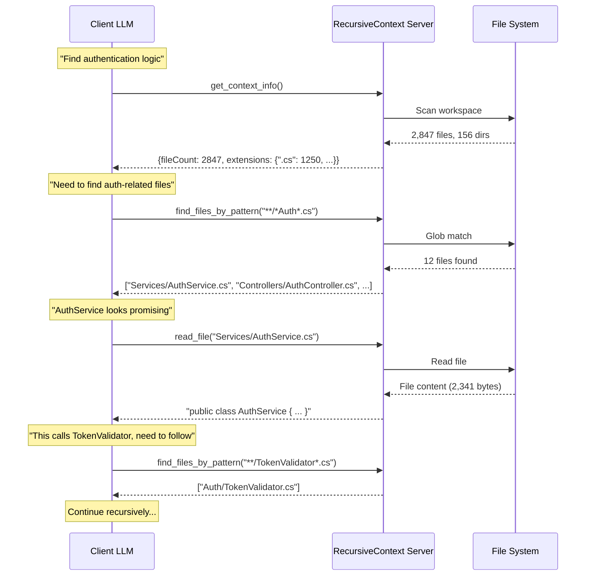

# RecursiveContext.Mcp

**An MCP server that enables Recursive Language Model (RLM)-style reasoning over massive offline context.**

[](https://dotnet.microsoft.com)
[](https://github.com/modelcontextprotocol)
[](LICENSE)

This MCP (Model Context Protocol) server enables large language models to systematically search, traverse, and reason over massive offline context (e.g., large codebases or document sets) **without loading that context into the model's prompt window**.

> 📄 **Research Paper:** [Recursive Language Models](https://arxiv.org/abs/2512.24601)  
> *Alex L. Zhang, Tim Kraska, Omar Khattab (December 2025)*

---

## How Recursive Reasoning Emerges

This server provides **deterministic, read-only tools** for exploring a workspace. The recursive reasoning behavior emerges entirely from the **client LLM** (e.g., GitHub Copilot, Claude) repeatedly calling these tools.



### The Key Insight

- **Server:** Pure environment. No LLM, no reasoning, no memory between calls.
- **Client LLM:** Decides what to explore next based on previous results.
- **Together:** The LLM uses the server like a file system browser, recursively drilling down into relevant paths.

---

## What This Server Does NOT Do

| ❌ Does NOT | ✅ Does |
|-------------|---------|
| Run any LLM or AI model | Provide file system access via MCP |
| Decide what files are relevant | Return exactly what was requested |
| Remember previous tool calls | Process each call independently |
| Perform code analysis | Return raw file contents |
| Make recommendations | Enforce guardrails (rate limits, sandboxing) |

The intelligence comes from **your MCP client** (e.g., GitHub Copilot), not this server.

---

## Installation

### Option 1: Build from Source

```bash
git clone https://github.com/yourusername/mcp-recursive-context.git
cd mcp-recursive-context
dotnet build
```

Run directly:
```bash
dotnet run --project src/RecursiveContext.Mcp.Server
```

### Option 2: .NET Tool (coming soon)

```bash
dotnet tool install -g RecursiveContext.Mcp
recursive-context
```

---

## Configuration

Configure via environment variables:

| Variable | Description | Default |
|----------|-------------|---------|
| `RLM_WORKSPACE_ROOT` | Root directory for file access (sandboxed). Supports absolute paths or relative paths like `.` (resolves to working directory) | Current directory |
| `RLM_MAX_BYTES_PER_READ` | Maximum bytes per file read | `1048576` (1 MB) |
| `RLM_MAX_TOOL_CALLS` | Maximum tool calls per session | `1000` |
| `RLM_TIMEOUT_SECONDS` | Timeout for long operations | `30` |
| `RLM_MAX_DEPTH` | Maximum directory depth for recursion | `20` |
| `RLM_MAX_FILES_PER_OP` | Maximum files per single operation | `20` |
| `RLM_MAX_FILES_PER_AGG` | Maximum files for aggregation operations | `500` |
| `RLM_MAX_MATCHES` | Maximum pattern matches to return | `10000` |
| `RLM_MAX_CHUNK_SIZE` | Maximum lines per chunk | `500` |

---

## MCP Client Configuration

### GitHub Copilot (VS Code)

Add to your `.vscode/mcp.json`:

```json
{
  "servers": {
    "recursive-context": {
      "command": "dotnet",
      "args": ["run", "--project", "C:/path/to/mcp-recursive-context/src/RecursiveContext.Mcp.Server"],
      "env": {
        "RLM_WORKSPACE_ROOT": "."
      }
    }
  }
}
```

> **Note:** Using `"."` for `RLM_WORKSPACE_ROOT` resolves to the working directory where the server runs (typically the workspace folder). This is ideal for multi-repository setups where each workspace has its own MCP configuration.

### Claude Desktop

Add to `claude_desktop_config.json`:

```json
{
  "mcpServers": {
    "recursive-context": {
      "command": "dotnet",
      "args": ["run", "--project", "/path/to/mcp-recursive-context/src/RecursiveContext.Mcp.Server"],
      "env": {
        "RLM_WORKSPACE_ROOT": "/path/to/your/codebase"
      }
    }
  }
}
```

---

## Available Tools

### 📁 File System Tools

#### `list_files`
Lists files in a directory with metadata.

| Parameter | Type | Description | Default |
|-----------|------|-------------|---------|
| `path` | string | Relative path to directory. Use `.` for root. | Required |
| `skip` | int | Items to skip (pagination) | `0` |
| `take` | int | Items to take (pagination) | `100` |

**Example Response:**
```json
{
  "path": "src/Services",
  "files": [
    {"name": "AuthService.cs", "sizeBytes": 2341, "lastModified": "2025-01-18T10:30:00Z"},
    {"name": "UserService.cs", "sizeBytes": 1892, "lastModified": "2025-01-17T14:22:00Z"}
  ],
  "totalCount": 2,
  "skip": 0,
  "take": 100
}
```

#### `list_directories`
Lists subdirectories with file and subdirectory counts.

| Parameter | Type | Description | Default |
|-----------|------|-------------|---------|
| `path` | string | Relative path to directory. Use `.` for root. | Required |

#### `read_file`
Reads the full content of a file (subject to size limits).

| Parameter | Type | Description | Default |
|-----------|------|-------------|---------|
| `path` | string | Relative path to file | Required |

#### `read_file_chunk`
Reads a portion of a file by line range. Ideal for large files.

| Parameter | Type | Description | Default |
|-----------|------|-------------|---------|
| `path` | string | Relative path to file | Required |
| `startLine` | int | Start line (0-based) | `0` |
| `endLine` | int | End line (0-based, inclusive) | `100` |

**Example Response:**
```json
{
  "path": "src/Program.cs",
  "startLine": 0,
  "endLine": 10,
  "totalLines": 42,
  "content": "using System;\n\nnamespace MyApp\n{\n    class Program\n    {\n        static void Main()\n        {\n            // Entry point\n        }\n    }"
}
```

### 🔍 Search Tools

#### `find_files_by_pattern`
Finds files matching a glob pattern.

| Parameter | Type | Description | Default |
|-----------|------|-------------|---------|
| `pattern` | string | Glob pattern (`*.cs`, `**/*.json`, `src/**/*Controller.cs`) | Required |
| `maxResults` | int | Maximum results to return | `100` |

**Supported Wildcards:**
- `*` - Matches any characters within a path segment
- `**` - Matches any characters across path segments (recursive)
- `?` - Matches a single character

### 📊 Metadata Tools

#### `get_context_info`
Returns workspace metadata for orientation.

| Parameter | Type | Description | Default |
|-----------|------|-------------|---------|
| `maxDepth` | int | Maximum recursion depth | `10` |

**Example Response:**
```json
{
  "workspaceRoot": "C:/projects/myapp",
  "totalFiles": 1250,
  "totalDirectories": 87,
  "totalSizeBytes": 12582912,
  "extensionCounts": {
    ".cs": 892,
    ".json": 45,
    ".md": 12,
    ".csproj": 8
  }
}
```

### ⚙️ Server Tools

#### `get_server_info`
Returns server metadata and guardrail status.

**Example Response:**
```json
{
  "serverName": "recursive-context",
  "serverVersion": "1.0.0",
  "maxBytesPerRead": 1048576,
  "maxToolCallsPerSession": 1000,
  "remainingToolCalls": 987
}
```

### 📊 Analysis Tools (RLM-Optimized)

These tools are specifically designed for **Recursive Language Model** scenarios. They provide **deterministic, symbolic outputs** that an LLM can use for mathematical reasoning rather than text parsing.

> **Key Principle:** Each tool call produces the **exact same output** for the same input. No summaries, no interpretations—just precise data.

#### `count_pattern_matches`
Counts regex pattern matches in a file. Returns exact count, not text to parse.

| Parameter | Type | Description | Default |
|-----------|------|-------------|---------|
| `path` | string | Relative path to file | Required |
| `pattern` | string | Regular expression pattern | Required |
| `maxMatches` | int | Safety limit to prevent runaway | `1000` |

**Example:**
```
count_pattern_matches("Services/AuthService.cs", "class\\s+\\w+", 100)
→ {"count": 3, "pattern": "class\\s+\\w+", "truncated": false}
```

#### `search_with_context`
Finds pattern matches with surrounding lines for context.

| Parameter | Type | Description | Default |
|-----------|------|-------------|---------|
| `path` | string | Relative path to file | Required |
| `pattern` | string | Search pattern (regex) | Required |
| `contextLines` | int | Lines before/after match | `2` |
| `maxMatches` | int | Maximum matches to return | `50` |

**Example Response:**
```json
[
  {"line": 42, "content": "public class AuthService : IAuthService", "context": ["using System;", "namespace Services", "{", "public class AuthService : IAuthService", "{"]}
]
```

#### `count_lines`
Returns the exact line count of a file.

| Parameter | Type | Description | Default |
|-----------|------|-------------|---------|
| `path` | string | Relative path to file | Required |

**Returns:** `1247` (just the number, ready for arithmetic)

#### `get_chunk_info`
Returns deterministic chunk boundaries for a file. Essential for systematic traversal.

| Parameter | Type | Description | Default |
|-----------|------|-------------|---------|
| `path` | string | Relative path to file | Required |
| `chunkSize` | int | Lines per chunk | `100` |

**Example Response:**
```json
{
  "totalLines": 1247,
  "chunkCount": 13,
  "chunkSize": 100,
  "chunkBoundaries": [
    {"index": 0, "startLine": 1, "endLine": 100},
    {"index": 1, "startLine": 101, "endLine": 200},
    ...
    {"index": 12, "startLine": 1201, "endLine": 1247}
  ]
}
```

#### `read_chunk_by_index`
Reads a specific chunk by index. Designed for iterative traversal.

| Parameter | Type | Description | Default |
|-----------|------|-------------|---------|
| `path` | string | Relative path to file | Required |
| `chunkIndex` | int | 0-based chunk index | Required |
| `chunkSize` | int | Lines per chunk (must match get_chunk_info) | `100` |

**Example Response:**
```json
{
  "chunkIndex": 5,
  "startLine": 501,
  "endLine": 600,
  "totalChunks": 13,
  "content": "// Lines 501-600..."
}
```

#### `count_files`
Counts files matching a glob pattern across directories.

| Parameter | Type | Description | Default |
|-----------|------|-------------|---------|
| `path` | string | Starting directory | Required |
| `pattern` | string | Glob pattern (`*.cs`, `**/*.json`) | Required |
| `recursive` | bool | Search subdirectories | `true` |

**Returns:** `892` (exact count for reasoning)

#### `aggregate_matches`
Counts pattern matches across multiple files. Perfect for codebase-wide analysis.

| Parameter | Type | Description | Default |
|-----------|------|-------------|---------|
| `path` | string | Starting directory | Required |
| `filePattern` | string | Glob pattern for files | Required |
| `searchPattern` | string | Regex to count matches | Required |
| `maxMatches` | int | Safety limit | `10000` |

**Example Response:**
```json
{
  "totalMatches": 47,
  "filesSearched": 12,
  "truncated": false,
  "matchesByFile": [
    {"path": "Services/AuthService.cs", "count": 8},
    {"path": "Services/UserService.cs", "count": 5}
  ]
}
```

---

## Understanding Deterministic vs Navigation Tools

This server provides two categories of tools:

| Category | Purpose | Example Tools |
|----------|---------|---------------|
| **Navigation** | Explore structure, find files | `list_files`, `list_directories`, `find_files_by_pattern` |
| **Analysis** | Get precise, countable data | `count_pattern_matches`, `count_lines`, `aggregate_matches` |

**Navigation tools** help the LLM decide *where* to look.  
**Analysis tools** give the LLM *exact data* to reason with.

### Why Determinism Matters

When an LLM calls `count_pattern_matches("file.cs", "class\\s+\\w+")`:
- It gets `{"count": 5}`, not "there are approximately 5 classes"
- The same input **always** produces the same output
- The LLM can use this in calculations: "5 classes × ~50 lines each = ~250 lines to review"

---

## Example: Systematic Large File Analysis

Here's how an LLM uses chunk traversal to analyze a file too large to read at once:

```
User: "How many TODO comments are in the large DataProcessor.cs file?"

LLM thinking: I need to count TODOs but the file might be huge. Let me check.

[Tool Call] count_lines("src/DataProcessor.cs")
→ 2,847

LLM thinking: 2,847 lines is too large to read at once. I'll use chunk traversal.

[Tool Call] get_chunk_info("src/DataProcessor.cs", 100)
→ {"totalLines": 2847, "chunkCount": 29, "chunkBoundaries": [...]}

LLM thinking: 29 chunks. I could read each and count, or use aggregate analysis.

[Tool Call] count_pattern_matches("src/DataProcessor.cs", "TODO|FIXME|HACK", 1000)
→ {"count": 23, "truncated": false}

LLM: "DataProcessor.cs contains exactly 23 TODO/FIXME/HACK comments across its 2,847 lines."
```

The LLM used **symbolic reasoning**:
1. Check file size → decide strategy
2. Use specialized counting tool → get exact answer
3. Combine facts → provide precise response

No guessing, no parsing text, no "approximately"—just math.

---

## Example Session: Finding Authentication Logic

Here's how a client LLM might use these tools to find authentication logic in a large codebase:

```
User: "Find where password hashing is implemented"

LLM thinking: I need to explore this codebase. Let me start with an overview.

[Tool Call] get_context_info()
→ Response: 2,341 files, mostly .cs (1,892), some .json (89)

LLM thinking: Large C# codebase. Let me find auth-related files.

[Tool Call] find_files_by_pattern("**/*Password*.cs")
→ Response: ["Security/PasswordHasher.cs", "Services/PasswordValidator.cs"]

LLM thinking: PasswordHasher.cs looks like what we need. Let me read it.

[Tool Call] read_file("Security/PasswordHasher.cs")
→ Response: Full file content showing BCrypt implementation

LLM: "Password hashing is implemented in Security/PasswordHasher.cs 
      using BCrypt with a work factor of 12. The HashPassword() method 
      generates salted hashes, and VerifyPassword() uses constant-time 
      comparison to prevent timing attacks."
```

---

## Architecture

```
RecursiveContext.Mcp.Server/
├── Server/
│   ├── ServerHost.cs          # MCP server setup and DI
│   └── ServerMetadata.cs      # Server name and version
├── Config/
│   ├── RlmSettings.cs         # Configuration record (8 guardrail limits)
│   ├── ConfigReader.cs        # Environment variable reader
│   └── PathResolver.cs        # Path sandboxing and resolution
├── Services/
│   ├── FileSystemService.cs   # File/directory operations
│   ├── PatternMatchingService.cs  # Glob pattern matching
│   ├── ContextMetadataService.cs  # Workspace statistics
│   ├── GuardrailService.cs    # Rate limiting and byte limits
│   ├── ContentAnalysisService.cs  # Pattern counting, line counting
│   ├── ChunkingService.cs     # Deterministic chunk boundaries
│   └── AggregationService.cs  # Cross-file pattern aggregation
├── Tools/
│   ├── FileSystem/            # list_files, read_file, etc.
│   ├── Search/                # find_files_by_pattern
│   ├── Metadata/              # get_context_info
│   ├── Analysis/              # count_pattern_matches, get_chunk_info, etc.
│   └── Server/                # get_server_info
└── Models/
    └── Models.cs              # All model records (FileInfo, ChunkInfo, etc.)
```

### Design Principles

1. **Read-Only:** No file writes, no side effects
2. **Sandboxed:** All paths resolved relative to workspace root
3. **Rate-Limited:** Prevents runaway tool call loops
4. **Stateless:** Each tool call is independent
5. **Railway-Oriented:** Uses `Result<T>` for error handling

---

## Security

### Path Sandboxing
All file paths are resolved relative to `RLM_WORKSPACE_ROOT`. Directory traversal attacks (`../../../etc/passwd`) are blocked.

### Rate Limiting
Tool calls are limited per session to prevent infinite loops. Check `get_server_info` to see remaining calls.

### Read-Only
The server cannot modify files. All operations are read-only.

---

## Development

### Prerequisites
- .NET 9 SDK
- Visual Studio 2022 / VS Code / Rider

### Build & Test

```bash
# Build
dotnet build

# Run tests
dotnet test

# Run server
dotnet run --project src/RecursiveContext.Mcp.Server
```

### Project Structure

```
mcp-recursive-context/
├── src/
│   └── RecursiveContext.Mcp.Server/
├── tests/
│   └── RecursiveContext.Mcp.Server.Tests/
└── RecursiveContext.Mcp.sln
```

---

## Contributing

Contributions are welcome! Please:

1. Fork the repository
2. Create a feature branch
3. Write tests for new functionality
4. Ensure all tests pass
5. Submit a pull request

---

## License

MIT License. See [LICENSE](LICENSE) for details.

---

## Acknowledgments

- [Recursive Language Models](https://arxiv.org/abs/2512.24601) paper by Zhang, Kraska, and Khattab
- [Model Context Protocol](https://github.com/modelcontextprotocol) by Anthropic
- [CSharpFunctionalExtensions](https://github.com/vkhorikov/CSharpFunctionalExtensions) for Result types
